# Hi, I'm Ozan 👋

Full-Stack Developer focused on building **scalable, real-world web applications**.  
I enjoy turning ideas into **clean, maintainable products** and continuously improving both **code quality** and **system architecture**.

---

## 🧠 About Me
- 💻 Full-Stack Developer (MERN + TypeScript)
- 🚀 Interested in **SaaS products**, dashboards, and automation
- 🧩 Strong focus on **backend architecture & APIs**
- 📈 Data-driven mindset (finance, performance, optimization)

---

## 🛠 Tech Stack

**Frontend**
- React, React Native
- TypeScript, JavaScript
- Tailwind CSS

**Backend**
- Node.js, Express
- MongoDB (Mongoose), PostgreSQL
- REST APIs, JWT Authentication

**DevOps / Tools**
- Git & GitHub
- Linux
- AWS / VPS deployments

---

## 📌 Currently Working On
- 🧾 Budget & finance tracking applications
- 📊 Admin dashboards & internal tools
- 🔄 Improving system design & scalability

---

## 🧪 What I Care About
- Clean architecture
- Readable & maintainable code
- Performance & scalability
- Learning by building real products

---

## 📊 GitHub Activity

---

## 🤝 Let's Connect
- 💼 LinkedIn: *https://www.linkedin.com/in/ozangurer/*
- 📫 Reach me via GitHub

> “Build things. Break things. Learn fast.”
